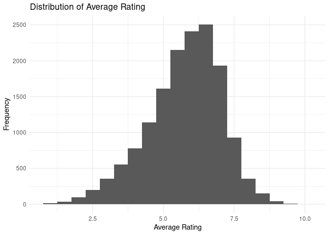
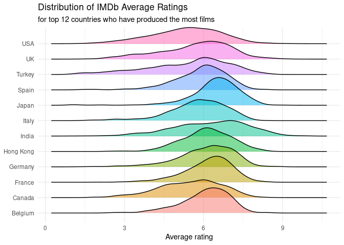
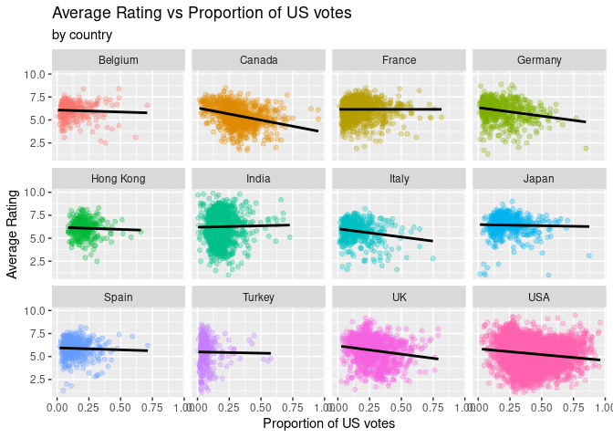
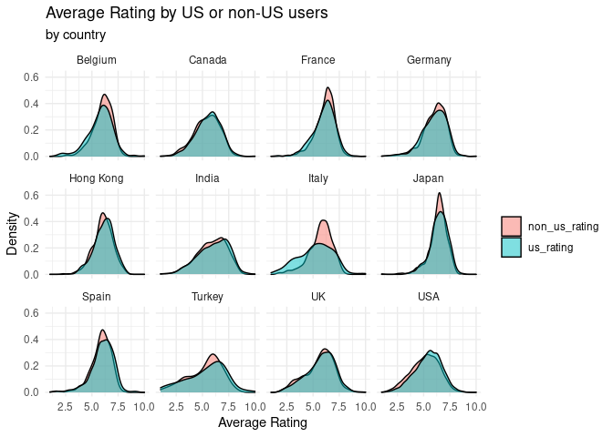
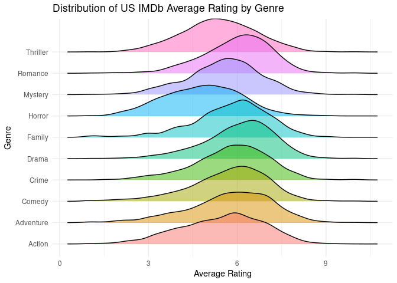

How does the country a film was made in affect iMDb ratings?
================
Calcutta_Coders

Introduction:

Our aim in this project is to find out how IMDb ratings compare for
films from different countries. We are using a data set called IMDb
movies from kaggle. The data set was originally from the public iMDb
website which shows all the ratings and then this was filtered to only
films from 1990 to today, in order to make the analysis more relevant.
We also scraped the variables us_votes (number of US votes), us_rating
(average rating from US users), non_us_votes (number of non US votes),
and non_us_rating (average rating from non US users). Each case is a
different film for this data set. We will compare how the country of
origin affects iMDb ratings.

Data analysis plan:

The outcome (response, Y) will be the average imdb ratings, The
predictor (explanatory, X) will be country. We will take a look at
whether the proportion of US votes negatively impacts a movie’s rating
for each country. Finally, to further analyze this relationship, we will
consider possible confounding variables including genre and us income.

## Summary

To start with we will look at the spread of the general ratings on IMDb.

<!-- -->

From the graph we can see that there is a large left skew, showing that
most movies are rated higher on IMDb.

Next if we look at the average ratings per country we can start to build
up an understanding of how films produced in different countries compare
with there average IMDbs ratings.

<table class="gt_table">
  
  <thead class="gt_col_headings">
    <tr>
      <th class="gt_col_heading gt_columns_bottom_border gt_left" rowspan="1" colspan="1">Country</th>
      <th class="gt_col_heading gt_columns_bottom_border gt_right" rowspan="1" colspan="1">Mean Rating</th>
      <th class="gt_col_heading gt_columns_bottom_border gt_right" rowspan="1" colspan="1">Median Rating</th>
    </tr>
  </thead>
  <tbody class="gt_table_body">
    <tr><td class="gt_row gt_left">Japan</td>
<td class="gt_row gt_right">6.440102</td>
<td class="gt_row gt_right">6.5</td></tr>
    <tr><td class="gt_row gt_left">India</td>
<td class="gt_row gt_right">6.255296</td>
<td class="gt_row gt_right">6.4</td></tr>
    <tr><td class="gt_row gt_left">France</td>
<td class="gt_row gt_right">6.173746</td>
<td class="gt_row gt_right">6.3</td></tr>
    <tr><td class="gt_row gt_left">Germany</td>
<td class="gt_row gt_right">6.088117</td>
<td class="gt_row gt_right">6.3</td></tr>
    <tr><td class="gt_row gt_left">Belgium</td>
<td class="gt_row gt_right">6.069436</td>
<td class="gt_row gt_right">6.2</td></tr>
    <tr><td class="gt_row gt_left">Hong Kong</td>
<td class="gt_row gt_right">6.113081</td>
<td class="gt_row gt_right">6.1</td></tr>
    <tr><td class="gt_row gt_left">Spain</td>
<td class="gt_row gt_right">5.901798</td>
<td class="gt_row gt_right">6.0</td></tr>
    <tr><td class="gt_row gt_left">Italy</td>
<td class="gt_row gt_right">5.773190</td>
<td class="gt_row gt_right">5.9</td></tr>
    <tr><td class="gt_row gt_left">UK</td>
<td class="gt_row gt_right">5.689785</td>
<td class="gt_row gt_right">5.9</td></tr>
    <tr><td class="gt_row gt_left">Turkey</td>
<td class="gt_row gt_right">5.434906</td>
<td class="gt_row gt_right">5.8</td></tr>
    <tr><td class="gt_row gt_left">Canada</td>
<td class="gt_row gt_right">5.494717</td>
<td class="gt_row gt_right">5.6</td></tr>
    <tr><td class="gt_row gt_left">USA</td>
<td class="gt_row gt_right">5.329991</td>
<td class="gt_row gt_right">5.4</td></tr>
  </tbody>
  
  
</table>

<!-- -->

From this we can see that Japan and India have by far the highest
average rating, with the US and Canada having a considerably lower
rating.

Now lets have a look at whether the proportion of US votes impacts the
rating of the film?

    ## `geom_smooth()` using formula 'y ~ x'

<!-- -->

We are now taking a look at whether the average rating is impacted by
the proportion of us voters. Overall, you can see that either the
proportion of US voters does not impact the rating, such as for Belgium
and Japan, OR a higher proportion of US voters results in a lower
rating, such as for Italy and Germany. The USA has a negative
association, but this may be because better films will be watched by
nonUS users.

    ## # A tibble: 13 × 5
    ##    term             estimate std.error statistic  p.value
    ##    <chr>               <dbl>     <dbl>     <dbl>    <dbl>
    ##  1 (Intercept)        5.89      0.0713    82.5   0       
    ##  2 prop_us_votes     -0.618     0.0832    -7.43  1.14e-13
    ##  3 countryCanada     -0.126     0.0851    -1.48  1.39e- 1
    ##  4 countryFrance      0.261     0.0787     3.32  9.15e- 4
    ##  5 countryGermany     0.255     0.0849     3.00  2.68e- 3
    ##  6 countryHong Kong   0.404     0.0992     4.07  4.63e- 5
    ##  7 countryIndia       0.262     0.0770     3.40  6.71e- 4
    ##  8 countryItaly      -0.550     0.0908    -6.06  1.38e- 9
    ##  9 countryJapan       0.711     0.0885     8.03  1.05e-15
    ## 10 countrySpain       0.219     0.0933     2.34  1.92e- 2
    ## 11 countryTurkey     -0.472     0.102     -4.64  3.59e- 6
    ## 12 countryUK          0.0109    0.0801     0.136 8.92e- 1
    ## 13 countryUSA        -0.193     0.0760    -2.54  1.10e- 2

This is a linear regression of this relationship. The second line
reveals that for all countries, as the proportion of US votes increases
by 1, the average rating decreases on average by 0.6. Other lines in the
regression output shows the average rating of a country when the
proportion of US votes is held constant. Some of the low average ratings
include Italy and Turkey. Overall, this regression reveals that for most
foreign countries, higher proportions of US users negatively impact
their ratings

Lets now compare how US users rate films to how non-US users rate films

<!-- -->

This graph displays the distribution of average rating from US users or
from non-US users. From the graph again we can see that Japanese films
have high ratings from both US and non-US voters, but they do have a
slightly higher rating from non-US voters. One reason the Japanese films
are rated so highly could be because of the worldwide love of anime.
Furthermore if we look at another country not known for this such as
Italy we can see large variation between the US voter rating and non-US
voter rating with the latter being far higher.

We can now look at some different variables which might be able to
explain these differences, to do this ill pass over to my college
Fletcher.

Firstly lets see if its the genre of films that the country is producing
which is causing the discrepancy’s. To do this lets first see which
genres tend to be the worst rated by Americans users.

    ## Picking joint bandwidth of 0.243

<!-- -->

From this we can see that Animation and Drama are by far the highest
rated, followed by Crime, Comedy and action. Finally Horror is byfar the
lowest rated out of the most common genres.

Now lets see which are the top genres for each country:

    ## # A tibble: 19 × 3
    ##   genre        n   prop
    ##   <chr>    <int>  <dbl>
    ## 1 Drama      270 0.294 
    ## 2 Comedy     245 0.267 
    ## 3 Crime       58 0.0632
    ## 4 Thriller    53 0.0578
    ## 5 Romance     48 0.0523
    ## # … with 14 more rows

    ## # A tibble: 20 × 3
    ##   genre         n   prop
    ##   <chr>     <int>  <dbl>
    ## 1 Drama       299 0.212 
    ## 2 Action      188 0.133 
    ## 3 Animation   176 0.125 
    ## 4 Comedy      148 0.105 
    ## 5 Adventure   123 0.0873
    ## # … with 15 more rows

    ## # A tibble: 22 × 3
    ##   genre        n   prop
    ##   <chr>    <int>  <dbl>
    ## 1 Drama     2760 0.222 
    ## 2 Comedy    1826 0.147 
    ## 3 Thriller  1288 0.104 
    ## 4 Action    1072 0.0862
    ## 5 Horror    1053 0.0847
    ## # … with 17 more rows

We know that the Horror genre is quite poorly rated by US users so this
could explain why films produced in Italy are on the whole not as high
rated. Japan has a large percentage of Animation movies, which should
then lead to them being above averagely rated by American Users. However
we see that Japan is still underrated compared to the rest of the world
by American users. So as we see the US does underrate all of the major
non-English speaking countries, and the main genres of film produced by
the other countries does not discount this. This leads me to conclude
that the US is unable to get over the one inch barrier of subtitles and
therefore has a bias against non English films.

    ## # A tibble: 6 × 5
    ##   term           estimate std.error statistic  p.value
    ##   <chr>             <dbl>     <dbl>     <dbl>    <dbl>
    ## 1 (Intercept)       5.49     0.0255    215.   0       
    ## 2 genreAnimation    0.786    0.0641     12.3  1.85e-34
    ## 3 genreComedy       0.223    0.0312      7.14 9.70e-13
    ## 4 genreCrime        0.328    0.0398      8.24 1.90e-16
    ## 5 genreDrama        0.569    0.0292     19.5  4.69e-84
    ## 6 genreHorror      -0.665    0.0391    -17.0  2.20e-64

Thanks for listening to our presentation!

Write-up of your project and findings go here. Think of this as the text
of your presentation. The length should be roughly 5 minutes when read
out loud. Although pacing varies, a 5-minute speech is roughly 750
words. To use the word count addin, select the text you want to count
the words of (probably this is the Summary section of this document, go
to Addins, and select the `Word count` addin). This addin counts words
using two different algorithms, but the results should be similar and as
long as you’re in the ballpark of 750 words, you’re good! The addin will
ignore code chunks and only count the words in prose.

## Presentation

Our presentation can be found [here](presentation/presentation.html).
The video of our presentation can be found
[here](https://media.ed.ac.uk/media/IDS+final+-+Calcutta+Coders/1_4v2f1upp).

## Data

Leone, S, 2020, *IMDb movies extensive dataset*, Kaggle, viewed 25
November 2021,
<https://www.kaggle.com/stefanoleone992/imdb-extensive-dataset>

Additional variables scraped from [imdb.com](https://www.imdb.com/).

## References

List any references here. You should, at a minimum, list your data
source.
