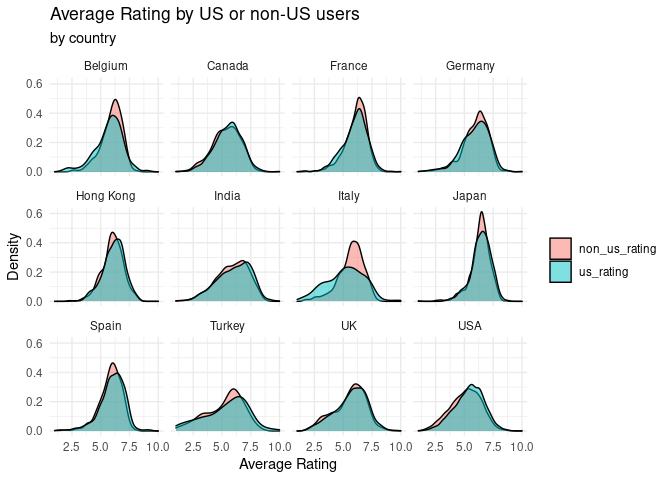
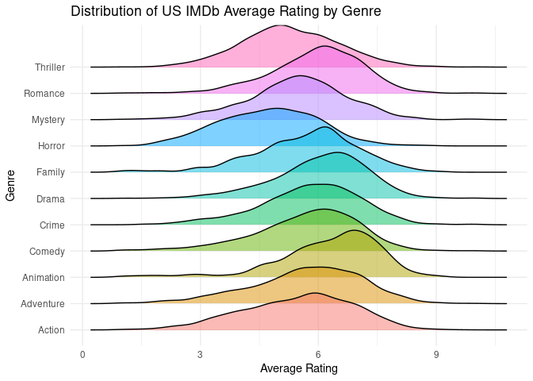

How does the country a film was made in affect IMDb ratings?
================
Calcutta_Coders

## Summary

Our aim in this project is to investigate whether US users have a bias
against foreign films. We are using a data set called IMDb movies from
kaggle. The data came from the public IMDb website. We filtered for only
films from 1990 to today, in order to keep the analysis relevant. We
also scraped the variables `us_votes` (number of US votes), `us_rating`
(average rating from US users), `non_us_votes` (number of non US votes),
and `non_us_rating` (average rating from non US users) directly from the
IMDb website. There are 15282 movies and 24 variables in the dataset.

<!-- -->

The shape of the distribution of `avg_vote` is left skewed, showing that
most movies are rated higher on IMDb, with a median of 5.9. To focus our
analysis, we have filtered for the top 12 countries who have produced
the most films rated on IMDb.

<!-- -->

From the distribution of `avg_vote` for each country we can see that
Japan and India have by far the highest average rating, with the US and
Canada having a considerably lower rating. This brings up the
possibility that the US overall rates movies lower than other countries
since their own movies have the lowest median. In order to understand
exactly how the number US votes impact the rating of a movie, we decided
to see if the proportion of US votes negatively impacts `avg_vote`.

    ## `geom_smooth()` using formula 'y ~ x'

<!-- -->

    ## # A tibble: 13 × 5
    ##    term             estimate std.error statistic  p.value
    ##    <chr>               <dbl>     <dbl>     <dbl>    <dbl>
    ##  1 (Intercept)        5.80      0.0779    74.4   0       
    ##  2 prop_us_votes     -0.547     0.0860    -6.36  2.08e-10
    ##  3 countryCanada     -0.0911    0.0917    -0.994 3.20e- 1
    ##  4 countryFrance      0.311     0.0855     3.64  2.78e- 4
    ##  5 countryGermany     0.255     0.0928     2.75  5.94e- 3
    ##  6 countryHong Kong   0.453     0.105      4.30  1.75e- 5
    ##  7 countryIndia       0.338     0.0832     4.06  4.96e- 5
    ##  8 countryItaly      -0.521     0.0970    -5.37  7.93e- 8
    ##  9 countryJapan       0.771     0.0949     8.12  4.95e-16
    ## 10 countrySpain       0.290     0.100      2.90  3.77e- 3
    ## 11 countryTurkey     -0.382     0.107     -3.56  3.67e- 4
    ## 12 countryUK          0.0534    0.0868     0.615 5.39e- 1
    ## 13 countryUSA        -0.149     0.0827    -1.81  7.10e- 2

Overall, we can see that either the proportion of US voters does not
impact the rating, such as for Belgium and Japan, or a higher proportion
of US voters results in a lower rating, such as for Italy and Germany.
The linear regression of this relationship reveals that for all
countries, as the proportion of US votes increases by 1, the average
rating decreases on average by 0.6. This supports the possibility that
the US overall rates movies lower. Furthermore, the US also has a
negative association; however, this may be because better films will be
watched by more non-US users. If this is the case, the data suggests
that US users underrate foreign films. To answer this we decided to
investigate the difference between `us_rating` and `non_us_rating`.

<!-- -->

This graph displays the distribution of average rating from US users or
from non-US users. Interestingly, all majority English speaking
countries, UK, US, and Canada, have higher overall ratings from US
users. This reveals that US users do not rate movies lower. We can see
that Japanese films have high ratings from both US and non-US voters,
but they do have a slightly higher rating from non-US voters. One reason
the Japanese films are rated so highly could be because of the worldwide
love of anime. Another noticeable case is Italy, who have a much higher
non-US rating. We can now look at some different variables which might
be able to explain these differences. We want to find out which genres
tend to be the worst rated by US users, by looking at the distribution
of `us_rating` for the most popular genres.

    ## Picking joint bandwidth of 0.262

<!-- -->

From this we can see that animation and drama are by far the highest
rated, followed by romance, comedy, crime, family, adventure, action,
mystery and thriller. Finally, horror is by far the lowest rated out of
the most common genres. To investigate how genre impacts US ratings we
are focusing on Italy, India, Japan and the US.

    ## # A tibble: 34 × 3
    ##   genre     n_Italy   prop
    ##   <chr>       <int>  <dbl>
    ## 1 Drama         258 0.281 
    ## 2 Comedy        241 0.263 
    ## 3 Crime          56 0.0611
    ## 4 Horror         35 0.0382
    ## 5 Biography      31 0.0338
    ## # … with 29 more rows

    ## # A tibble: 37 × 3
    ##   genre    n_India   prop
    ##   <chr>      <int>  <dbl>
    ## 1 Drama        916 0.257 
    ## 2 Comedy       557 0.156 
    ## 3 Action       553 0.155 
    ## 4 Romance      245 0.0686
    ## 5 Thriller     189 0.0529
    ## # … with 32 more rows

    ## # A tibble: 35 × 3
    ##   genre     n_Japan   prop
    ##   <chr>       <int>  <dbl>
    ## 1 Drama         258 0.183 
    ## 2 Action        188 0.133 
    ## 3 Animation     176 0.125 
    ## 4 Comedy        121 0.0859
    ## 5 Adventure      74 0.0525
    ## # … with 30 more rows

    ## # A tibble: 41 × 3
    ##   genre  n_USA   prop
    ##   <chr>  <int>  <dbl>
    ## 1 Drama   2447 0.197 
    ## 2 Comedy  1695 0.136 
    ## 3 Action  1069 0.0860
    ## 4 Horror   922 0.0741
    ## 5 Crime    709 0.0570
    ## # … with 36 more rows

    ## # A tibble: 6 × 5
    ##   term           estimate std.error statistic  p.value
    ##   <chr>             <dbl>     <dbl>     <dbl>    <dbl>
    ## 1 (Intercept)       5.49     0.0255    216.   0       
    ## 2 genreAnimation    0.788    0.0640     12.3  1.04e-34
    ## 3 genreComedy       0.219    0.0314      6.97 3.20e-12
    ## 4 genreCrime        0.307    0.0411      7.48 7.51e-14
    ## 5 genreDrama        0.571    0.0294     19.4  6.10e-83
    ## 6 genreHorror      -0.754    0.0407    -18.5  5.45e-76

We know that the horror genre is quite poorly rated by US users so this
could explain why films produced in Italy are on the whole not as high
rated. However, the US has a higher percentage of horror, and Italy has
high proportions of drama and comedy, both a part of the US’s three
favorite genres. This leads us to believe that `genre` is not the reason
why the US under-rates Italy. Additionally Japan has a large percentage
of animation movies, which should then lead to them being above
averagely rated by American users. However we see that Japan is still
slightly underrated compared to the rest of the world by American users.
India, who is over-rated by the US has lower proportions of the top
three highest US rated genres than Italy. Since the proportion of US
users negatively impacts rating, the US overrates the major English
speaking countries and genre does not explain some of US under-rating of
films, we are led to believe that the US does have a bias against
foreign movies, particularly movies from countries who’s primary
language is not English. Maybe the US still cannot get over the one inch
barrier of subtitles.

## Presentation

Our presentation can be found
[here](presentation/Presentation/PresentationCalcuttaCoders.html). The
video of our presentation can be found
[here](https://media.ed.ac.uk/media/IDS+final+-+Calcutta+Coders/1_4v2f1upp).

## Data

Leone, S 2020, *IMDb movies extensive dataset*, Kaggle, viewed 25
November 2021,
<https://www.kaggle.com/stefanoleone992/imdb-extensive-dataset>

Additional variables scraped from [imdb.com](https://www.imdb.com/).

## References

Leone, S 2020, *IMDb movies extensive dataset*, Kaggle, viewed 25
November 2021,
<https://www.kaggle.com/stefanoleone992/imdb-extensive-dataset>
