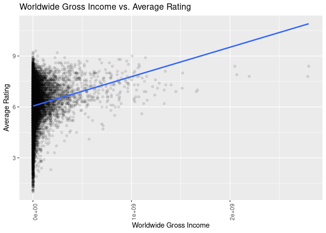

Project proposal
================
Calcutta_Coders

``` r
library(tidyverse)
library(broom)
library(ggridges)
```

## 1. Introduction

Our aim in this project is to find out how iMDb ratings compare for
films from different countries. We are using a data set called iMDb
movies that has come from kaggle. We will also compare how different
variables (title, year published, genre, budget, USA gross income,
Worldwide gross income, duration and actors) affect iMDb ratings and
also how many votes were cast for a film to recieve said rating.

## 2. Data

``` r
imdb <- read.csv(file = "../data/IMDb_movies.csv", header = TRUE, skip = 1)
glimpse(imdb)
```

    ## Rows: 85,855
    ## Columns: 19
    ## $ imdb_title_id         <chr> "tt0000009", "tt0000574", "tt0001892", "tt000210…
    ## $ title                 <chr> "Miss Jerry", "The Story of the Kelly Gang", "De…
    ## $ year                  <chr> "1894", "1906", "1911", "1912", "1911", "1912", …
    ## $ genre                 <chr> "Romance", "Biography, Crime, Drama", "Drama", "…
    ## $ duration              <int> 45, 70, 53, 100, 68, 60, 85, 120, 120, 55, 121, …
    ## $ country               <chr> "USA", "Australia", "Germany, Denmark", "USA", "…
    ## $ language              <chr> "None", "None", "", "English", "Italian", "Engli…
    ## $ director              <chr> "Alexander Black", "Charles Tait", "Urban Gad", …
    ## $ writer                <chr> "Alexander Black", "Charles Tait", "Urban Gad, G…
    ## $ production_company    <chr> "Alexander Black Photoplays", "J. and N. Tait", …
    ## $ actors                <chr> "Blanche Bayliss, William Courtenay, Chauncey De…
    ## $ avg_vote              <dbl> 5.9, 6.1, 5.8, 5.2, 7.0, 5.7, 6.8, 6.2, 6.7, 5.5…
    ## $ votes                 <int> 154, 589, 188, 446, 2237, 484, 753, 273, 198, 22…
    ## $ budget                <chr> "", "$ 2250", "", "$ 45000", "", "", "", "ITL 45…
    ## $ usa_gross_income      <chr> "", "", "", "", "", "", "", "", "", "", "", "", …
    ## $ worlwide_gross_income <chr> "", "", "", "", "", "", "", "", "", "", "", "", …
    ## $ metascore             <dbl> NA, NA, NA, NA, NA, NA, NA, NA, NA, NA, NA, NA, …
    ## $ reviews_from_users    <dbl> 1, 7, 5, 25, 31, 13, 12, 7, 4, 8, 9, 9, 16, 8, N…
    ## $ reviews_from_critics  <dbl> 2, 7, 2, 3, 14, 5, 9, 5, 1, 1, 9, 28, 7, 23, 4, …

## 3. Data analysis plan

The outcome (response, Y) will be the average imdb ratings, The
predictor (explanatory, X) will be country. To properly explore more
relationships we will use gross and worlwide income to see if the movie
did well worldwide or just in the us. We can also take a look at how
factors such as genre, number of votes and duration impact the rating of
a movie. We can see how IMDb rates their films in comparison to another
rating site, metascore.

``` r
imdb_country <- imdb %>%
   mutate(country = sub("\\ ", "", country)) %>%
   separate_rows(country, sep = "\\,")
   
imdb_country %>%
   count(country) %>%
   arrange(desc(n))
```

    ## # A tibble: 366 × 2
    ##    country      n
    ##    <chr>    <int>
    ##  1 USA      33304
    ##  2 France    7374
    ##  3 UK        6905
    ##  4 India     6320
    ##  5 Italy     4695
    ##  6 Japan     3499
    ##  7 Canada    3318
    ##  8 Germany   3033
    ##  9 Spain     2391
    ## 10 HongKong  1527
    ## # … with 356 more rows

``` r
imdb_country %>%
   filter(
     country == c("USA", "France", "UK", "India", "Italy", "Germany", "Japan", "Canada", "Spain", "Hong Kong", "Turkey", "Belgium")
   ) %>%
   group_by(country) %>%
   summarise(
     mean_rating = mean(avg_vote, na.rm = TRUE),
     median_rating = median(avg_vote, na.rm = TRUE)
     ) %>%
   arrange(desc(mean_rating))
```

    ## Warning in country == c("USA", "France", "UK", "India", "Italy", "Germany", :
    ## longer object length is not a multiple of shorter object length

    ## # A tibble: 12 × 3
    ##    country   mean_rating median_rating
    ##    <chr>           <dbl>         <dbl>
    ##  1 Japan            6.52          6.7 
    ##  2 India            6.28          6.5 
    ##  3 France           6.26          6.3 
    ##  4 Hong Kong        6.22          6.5 
    ##  5 Germany          6.12          6.2 
    ##  6 Belgium          6.09          6.3 
    ##  7 Italy            6.05          6.2 
    ##  8 Spain            5.99          6.1 
    ##  9 UK               5.91          6.2 
    ## 10 Turkey           5.86          6.1 
    ## 11 USA              5.60          5.85
    ## 12 Canada           5.38          5.6

``` r
 imdb_country %>%
   filter(country == c("USA", "France", "UK", "India", "Italy", "Germany", "Japan", "Canada", "Spain", "Hong Kong", "Turkey", "Belgium")) %>%
   ggplot(aes(x = avg_vote, y = country, fill = country)) +
   geom_density_ridges(alpha = 0.5, show.legend = FALSE) +
   labs(
     title = "Distribution of IMDb Average Ratings",
     subtitle = "for top 12 countries who have produced the most films",
     x = "Average rating",
     y = "Country"
   )
```

    ## Warning in country == c("USA", "France", "UK", "India", "Italy", "Germany", :
    ## longer object length is not a multiple of shorter object length

    ## Picking joint bandwidth of 0.308

<!-- --> After
filtering for the top 12 countries who produce the largest number of
films, the distribution of `avg_vote` is observed. The countries with
the higher ratings include Japan, Belgium, France, Germany and India.
Even though the USA has the largest number of films produced, their mean
rating is the lowest of these countries.

``` r
imdb_country %>%
  filter(country != "USA") %>%
  group_by(country) %>%
  summarise(
    mean_rating = mean(avg_vote, na.rm = TRUE),
    count = n()
    ) %>%
  ggplot(aes(x = count, y = mean_rating)) +
  geom_point(alpha = 0.5) +
  geom_smooth() +
  labs(
    title = "Country's Mean Average Rating vs. the Number of Films Produced",
    x = "Count",
    y = "Mean Average Rating"
  )
```

    ## `geom_smooth()` using method = 'loess' and formula 'y ~ x'

<!-- -->

This graph intends to answer the question: Do countries who produce
larger amounts of films have an overall higher rating? After grouping by
country, the overall average IMDb average rating was calculated along
with the amount of movies in each category. This graph reveals that
there is little to no association between the amount of films produced
and the mean average rating.

``` r
imdb_genre <- imdb %>%
  mutate(genre = case_when(
    genre == "Sci Fi" ~ "Sci-Fi",
    genre == "Film Noir" ~ "Film-Noir",
    TRUE ~ genre)) %>%
  separate_rows(genre)
  

imdb_genre %>%
  group_by(genre) %>%
  summarise(
    mean_rating = mean(avg_vote, na.rm = TRUE),
    median_rating = median(avg_vote, na.rm = TRUE)
    ) %>%
  arrange(desc(mean_rating))
```

    ## # A tibble: 28 × 3
    ##    genre       mean_rating median_rating
    ##    <chr>             <dbl>         <dbl>
    ##  1 Documentary        7.3            7.3
    ##  2 Film               6.64           6.7
    ##  3 Noir               6.64           6.7
    ##  4 Biography          6.62           6.7
    ##  5 History            6.54           6.6
    ##  6 War                6.43           6.6
    ##  7 News               6.4            6.4
    ##  8 Animation          6.38           6.6
    ##  9 Musical            6.25           6.4
    ## 10 Music              6.24           6.4
    ## # … with 18 more rows

``` r
imdb_genre %>%
  ggplot(aes(x = avg_vote, y = genre, fill = genre)) +
  geom_density_ridges(alpha = 0.5, show.legend = FALSE) +
  labs(
    title = "Distribution of IMDb Average Rating by Genre",
    x = "Average Rating",
    y = "Genre"
  )
```

    ## Picking joint bandwidth of 0.252

<!-- --> This
graph reveals the distribution of `avg_vote`, which is the rating, for
every `genre`. As shown by the graph and the summary statistics, some
high rated genres include Documentary, Film Noir, Biography, History,
War and News. In these data analyses, films with multiple genres were
counted in each of their catagories.

``` r
imdb_income <- imdb %>%
  mutate( 
  worlwide_gross_income = na_if(worlwide_gross_income, "")) %>%
  transform(worlwide_gross_income = as.numeric(gsub("\\$", "", worlwide_gross_income)))
```

    ## Warning in eval(substitute(list(...)), `_data`, parent.frame()): NAs introduced
    ## by coercion

``` r
imdb_income %>%
  ggplot(aes(x = worlwide_gross_income, y = avg_vote)) +
  geom_point(alpha = 0.1) +
  theme(axis.text.x = element_text(angle = 90)) +
  labs(
    title = "Worldwide Gross Income vs. Average Rating",
    x = "Worldwide Gross Income",
    y = "Average Rating"
  )
```

    ## Warning: Removed 54900 rows containing missing values (geom_point).

<!-- --> This
graph explores the relationship between the `avg_vote` and
`worlwide_gross_income`. This graph has a weak positive association
suggesting that the more money that is gained from the film, the more
likely the film is to be rated well.

``` r
imdb %>%
  ggplot(aes(x = votes, y = avg_vote)) +
  geom_point(alpha = 0.1) +
  labs(
    title = "Average Rating Based on the Popularity of Movie",
    x = "Number of Votes",
    y = "Average Rating"
  )
```

<!-- --> This
graph compared `avg_vote` to `votes`, which indicates a movie’s
popularity. This graph reveals a positive association, suggesting that
the more popular a film is the more likely it will be rated higher.

``` r
imdb %>%
  ggplot(aes(x = duration, y = avg_vote)) +
  geom_point(alpha = 0.1) +
  labs(
    title = "Average Rating Based on Duration of a Movie",
    x = "Duration",
    y = "Average Rating"
  )
```

<!-- --> This
graph reveals there is little to no association between the `avg_vote`
and `duration` of a movie.

``` r
imdb %>%
  separate_rows(language, sep = "\\,") %>%
  group_by(language) %>%
  summarise(
    count = n(),
    mean = mean(avg_vote)) %>%
  ggplot(aes(x = count, y = mean, group = language)) +
  geom_point()
```

<!-- -->
